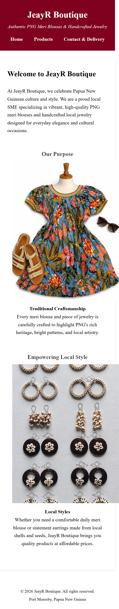
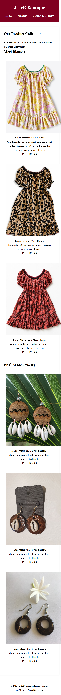
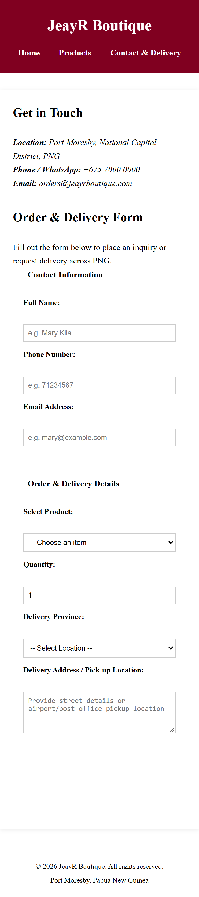
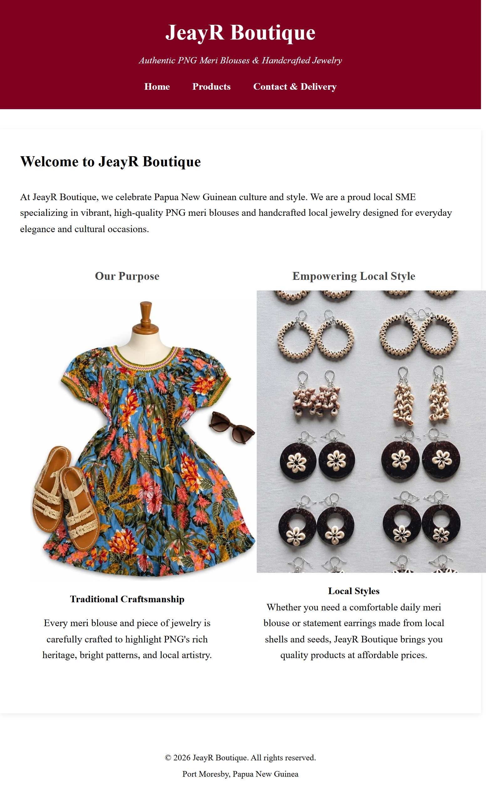
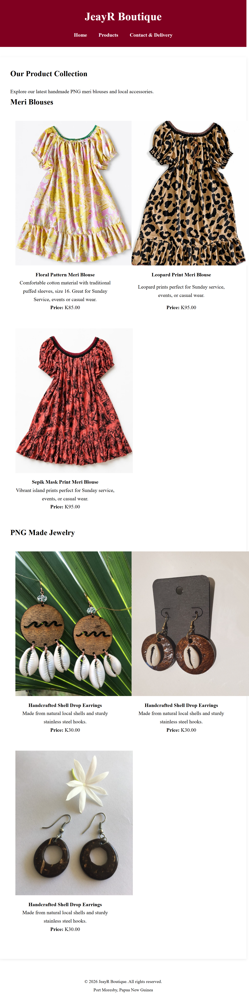
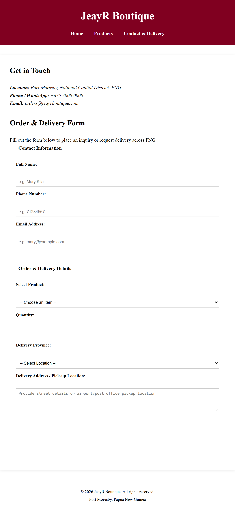
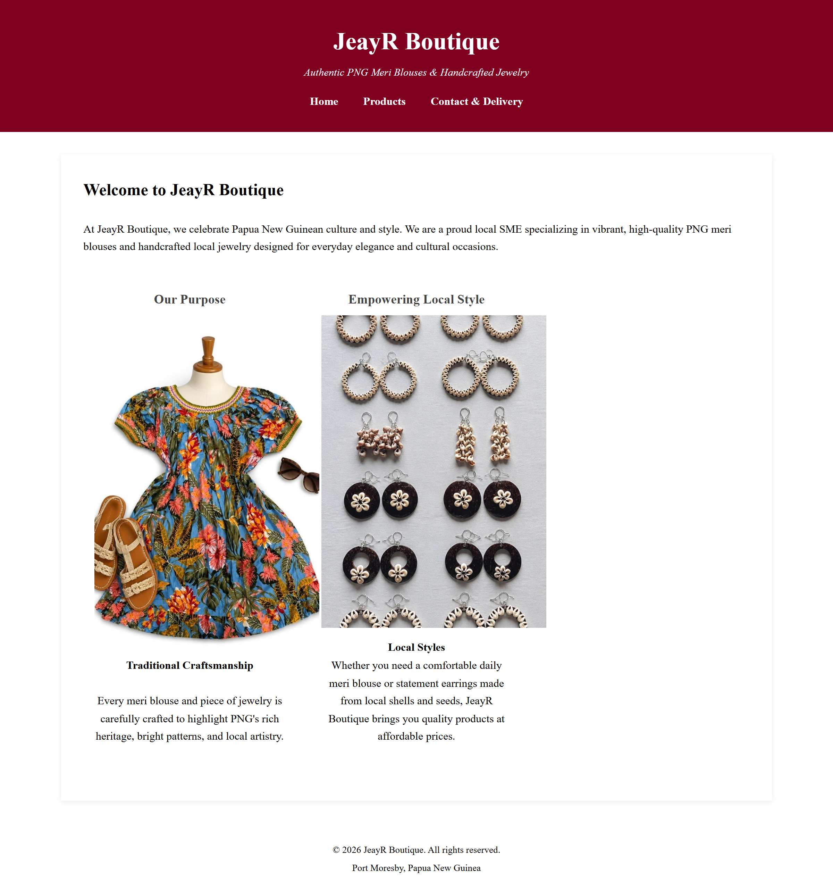
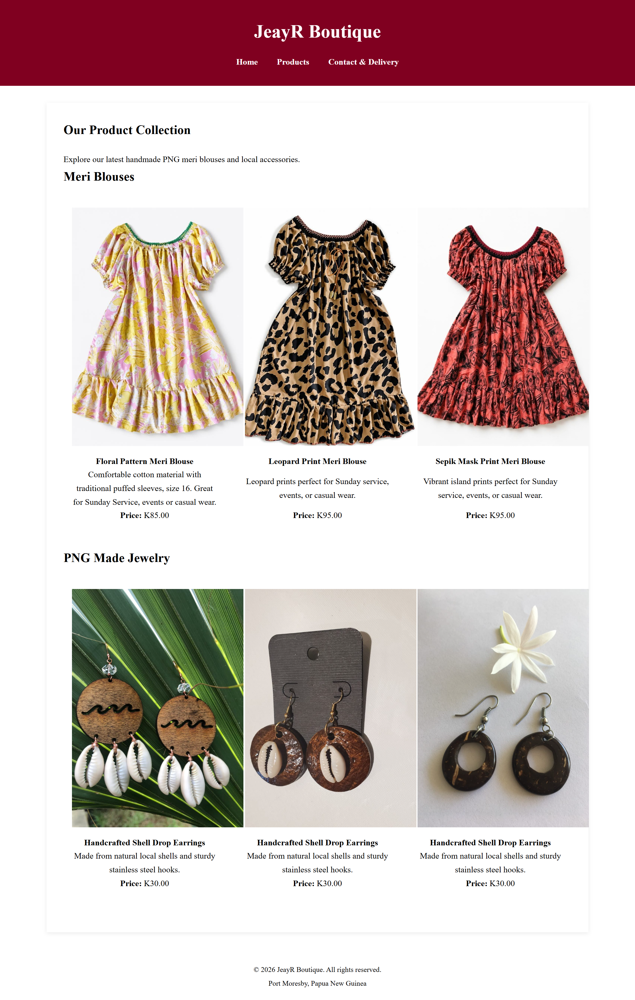
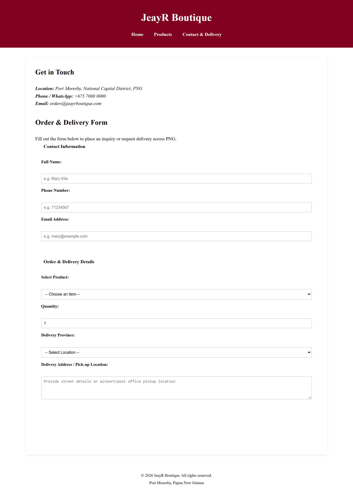

# ISO229 Assessment 3: Responsive Website

Student Name: Jerusah Yalwan
Student ID: 24704056

# Responsive Layouts
Flexbox: Used in 'nav ul' for horizontal navigation menu alignment.
CSS Grid: Used in .product-grid' to arrange items into 1 column (mobile), 2 column (tablet), 3 column (desktop).

## Screenshots & Testing Evidence
### Mobile View (375px)




### Tablet View (768px)




### Desktop View (1200px)




# AI Use Declaration
I used generative AI to assist with explaining CSS Grid and debugging responsive layout issues. I reviewed, modified, and tested the final work myself.

---

##  Project Overview

JeayR Boutique specializes in authentic Papua New Guinean cultural attire and handcrafted jewelry. This website serves as an online catalog and order request portal designed to showcase PNG meri blouses and handmade accessories to customers across PNG.

### Live Demo & Links
* **Live Website (GitHub Pages):** [https://jyalwan28-wq.github.io/JeayR_Boutique/)
* **GitHub Repository:** [https://github.com/jyalwan28-wq/JeayR_Boutique)

---

##  Key Features

* **Semantic HTML5 Structure:** Built using proper standard HTML5 tags (`<header>`, `<nav>`, `<main>`, `<section>`, `<article>`, `<figure>`, `<figcaption>`, `<address>`, `<footer>`) ensuring accessibility and SEO best practices.
* **Multi-Page Layout:**
  * **Home (`index.html`):** Introduces JeayR Boutique, its cultural purpose, and local brand identity.
  * **Products (`products.html`):** Structured catalog displaying PNG Meri blouses and handcrafted jewelry with image figures, descriptions, and pricing in PNG Kina (K).
  * **Contact & Delivery (`contact.html`):** Contact information alongside an interactive order inquiry and delivery request form tailored for local provinces (NCD, Morobe, Central, etc.).
* **Custom Responsive CSS Styling (`style.css`):**
  * Clean, cultural color theme (Burgundy `#800020` accents).
  * Flexbox-based product cards grid layout.
  * Responsive image scaling using CSS `object-fit: contain` to preserve original photo aspect ratios without cropping.
  * Custom styled form controls, fieldsets, and submit buttons.

---

##  Project Structure

```text
jeayr-boutique/
│
├── index.html          # Home page (Brand introduction & purpose)
├── products.html       # Products catalog (Meri blouses & jewelry)
├── contact.html        # Contact details & order/delivery form
├── style.css           # Global stylesheet
├── images/             # Local images directory
│   ├── MeriB001.png
│   ├── MeriB002.png
│   ├── MeriB003.png
│   └── Earring-1.png
└── README.md           # Project documentation
